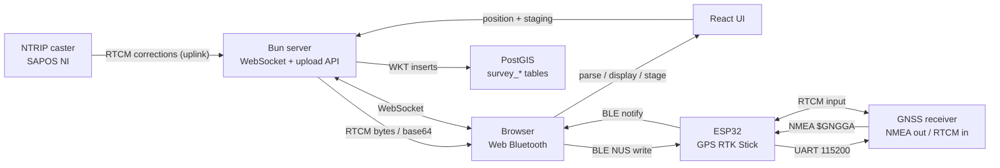

# GNSS RTK Survey Tool

A web-based RTK (Real-Time Kinematic) GNSS surveying application. It connects a
hardware GNSS receiver to a browser-based UI over Bluetooth Low Energy, feeds
RTCM correction data from an NTRIP caster back to the receiver to achieve
centimeter-level positioning, and stores surveyed geometries (points, lines,
polygons) in a PostGIS database.

## How it works



### Correction data path (downlink)

1. The browser obtains the first `$GNGGA` fix from the receiver and sends
   `{lat, lon}` over a WebSocket to the Bun server.
2. The server converts the position to ECEF (WGS-84) and connects to an NTRIP
   caster via `ntrip-client` (configured in `src/config.ts` — currently SAPOS
   Niedersachsen, VRS mountpoint).
3. Incoming RTCM bytes are coalesced (`BufferCoalescer`, ≤300 bytes / ≤100 ms),
   base64-encoded, and pushed to the browser over the WebSocket.
4. The browser decodes them and writes them to the BLE RX characteristic.
5. The ESP32 forwards the raw bytes to the GNSS receiver's UART — the receiver
   then reaches `RTK Fixed` / `RTK Float` fix quality.

### Position data path (uplink)

1. The GNSS receiver streams NMEA over UART to the ESP32.
2. The ESP32 buffers sentences, keeps only `$GNGGA`, verifies the NMEA XOR
   checksum, and notifies the browser via the BLE TX characteristic.
3. The frontend parses GGA into lat/lon, altitude, fix quality, satellite count
   and HDOP, and displays it.

### Survey upload

Staged positions are collected in the UI (persisted in `localStorage`), named,
typed (`points` | `line` | `polygon`), and POSTed to `/upload`. The server
converts them to WKT and inserts them into PostGIS tables (`survey_points`,
`survey_lines`, `survey_polygons`, SRID **4258** / ETRS89).

## Repository layout

```
├── src/
│   ├── index.ts                  # Bun server entry: routes, WS upgrade, TLS, HMR
│   ├── config.ts                 # NTRIP caster + Postgres connection config
│   ├── server/
│   │   ├── ws.ts                 # WebSocket handler: NTRIP client → RTCM → browser
│   │   ├── http.ts               # Request routing: /ws upgrade, 404 fallback
│   │   ├── logger.ts             # pino logging (pretty in dev, JSON in prod)
│   │   ├── BufferCoalescer.ts    # Batches small RTCM chunks before sending
│   │   ├── uploadHandler.ts      # POST /upload → PostGIS inserts (WKT, SRID 4258)
│   │   └── *.test.ts             # bun test suites + NTRIP integration tests
│   └── frontend/
│       ├── App.tsx               # Main UI: status bar, position, staging, upload
│       └── lib/
│           ├── ble/              # Web Bluetooth (NUS) + NMEA GGA parsing (jotai atoms)
│           ├── ws/               # WebSocket client: position up, RTCM down
│           ├── main/             # Position display/staging/manual entry/GIS upload
│           ├── status/           # BLE / WS / RTCM / GPS status indicators
│           ├── button/           # BLE connect button
│           ├── layout/           # Position / row formatting components
│           └── models/           # Shared types
├── esp32/
│   ├── src/ble_bridge_gnss.cpp   # ESP32 firmware: GNSS UART ↔ BLE NUS bridge
│   └── platformio.ini            # PlatformIO config (denky32 / generic ESP32)
├── mock-caster/                  # Stand-in NTRIP caster (container, dummy RTCM)
│   ├── caster.ts                 #   Handshake, RTCM3 framing, GGA capture
│   ├── serve.ts                  #   Container entrypoint
│   └── Dockerfile
├── docs/
│   ├── UI.md                     # Web UI guide: status pills, colors, upload flow
│   ├── screenshots/              # UI screenshots (regenerate via scripts/)
│   ├── create_tables.sql         # PostGIS schema (auto-loaded by devcontainer)
│   └── PROJECT_DOCUMENTATION.md
├── scripts/screenshots.ts        # Playwright UI screenshot generator
├── Dockerfile / compose.yaml     # App + PostGIS + ntrip-mock stack
├── .devcontainer/                # App + PostGIS dev environment (docker-compose)
└── cert.pem / key.pem            # Self-signed TLS cert (required for Web Bluetooth)
```

## Components

### ESP32 firmware (`esp32/`)

Arduino/PlatformIO firmware for a generic ESP32. Acts as a BLE peripheral
advertising as **"GPS RTK Stick"** using the Nordic UART Service (NUS).

- **GNSS → BLE:** reads UART2 (`GPIO 27` RX / `GPIO 25` TX @ 115200), filters
  `$GNGGA` sentences, verifies checksums, notifies the client.
- **BLE → GNSS:** raw pass-through — anything written to the RX characteristic
  (RTCM, config commands) goes straight to the receiver.
- MTU up to 512 bytes; auto-restarts advertising on disconnect.

### Bun server (`src/`)

- Serves the React SPA at `/` with HMR in development.
- Upgrades `GET /ws` requests to WebSocket and runs `NTRIPWebSocketHandler`: on
  the first position message it opens a per-connection NTRIP session and
  streams corrections back (structured logging via pino).
- `POST /upload` writes geometries to Postgres via `bun:sql`.
- TLS is enabled via `cert.pem`/`key.pem` — Web Bluetooth requires a secure
  context, so the app is served over HTTPS even locally.

### React frontend (`src/frontend/`)

React 19 + Mantine + Jotai. Connects to the ESP32 via Web Bluetooth, shows live
position/fix quality (GPS, DGPS, RTK Float, RTK Fixed), lets the user stage the
current or a manual position, shows haversine distance to the staged point, and
uploads named point/line/polygon features to PostGIS. See
[docs/UI.md](docs/UI.md) for a guide to the status pills, colors and upload flow
(with screenshots).

### Database

PostGIS 16 (via `compose.yaml` or the devcontainer — both mount the schema on
first start). Schema lives in
`docs/create_tables.sql` — three `survey_*` tables with `geometry(*, 4258)`
columns, timestamps, names and a `tags` jsonb column.

## Getting started

### Docker compose (run the whole stack)

```bash
docker compose up -d --build
```

Starts three services: the app (HTTPS on `:3000`, override with `APP_PORT`),
PostGIS with the schema auto-initialized, and `ntrip-mock` — a stand-in NTRIP
caster that accepts any credentials and streams dummy RTCM frames, so the whole
pipeline can be tested before real SAPOS credentials exist. Point the app at a
real caster via `NTRIP_HOST` / `NTRIP_MOUNTPOINT` / `NTRIP_USERNAME` /
`NTRIP_PASSWORD` (env or `.env`).

### Dev container (recommended for development)

The `.devcontainer` setup provides Bun plus a PostGIS database with the schema
auto-initialized and ports `3000`/`5432` forwarded. Open the repo in VS Code →
"Reopen in Container", then:

```bash
bun install
bun dev
```

### Bare metal

Requires [Bun](https://bun.com) and a Postgres+PostGIS instance:

```bash
bun install
# point the app at Postgres via env vars or POSTGRES_URL
# (PGHOST, PGPORT, PGUSER, PGPASSWORD, PGDATABASE)
psql "$POSTGRES_URL" -f docs/create_tables.sql
bun dev     # dev server with HMR
bun build   # production bundle → dist/
bun start   # production server
```

### Configuration

- **NTRIP credentials:** edit `src/config.ts` — the committed
  `username`/`password` are placeholders; you need a valid SAPOS (or other
  caster) account and mountpoint.
- **TLS:** replace `cert.pem`/`key.pem` with your own cert if the browser
  rejects the self-signed one (you'll need to accept the warning once).
- **ESP32 firmware:** see `esp32/README.md` — build/flash with PlatformIO.

### Usage

1. Start the server, open the HTTPS URL, accept the certificate warning.
2. Click **Connect BLE** and pick *GPS RTK Stick* in the browser's device
   picker. Do **not** pair it in the OS Bluetooth menu — a stale system
   connection stops the stick advertising and blocks the web app.
3. Once a GGA fix arrives, the app sends the position to the server, which
   starts the NTRIP stream — watch the fix quality progress to **RTK Fixed**.
4. Use **Stage Position** (or Manual Position) to capture points, then
   **Append Staged Position**, pick a geometry type/name, and **Upload**.

## Printable broomstick bubble-level mount

A two-piece clamp for a **27.5 mm diameter stick**, with a horizontal tray for
a **65.6 mm diameter × 10.5 mm high circular bubble level**. The seating plane
is perpendicular to the stick axis: the bubble indicates verticality when the
stick is upright. The level sits beside the stick, not on its end.

### Files

- [Holder and tray STL](parts/broomstick_level_holder.stl) — print one.
- [Removable clamp cap STL](parts/broomstick_level_clamp_cap.stl) — print one.
- [Assembly illustration](parts/broomstick_level_mount.png) — stick and level
  shown for context; bolts omitted.
- [Editable CAD generator](parts/broomstick_level_mount.py) — dimensions in
  millimetres at the top. Regenerate with
  `uv run parts/broomstick_level_mount.py`; this is a Python CAD tool, independent
  of the Bun application, with its own pinned dependencies.

The clamp is 48 mm tall with a 27.9 mm bore and a 1 mm split gap before tightening.
The level pocket is 66.2 mm across, with a 3 mm floor and 7 mm retaining wall.
The level protrudes 3.5 mm above the wall. The level centre is 66 mm from the
stick axis. Holder bounds are approximately 130.1 × 72.2 × 48 mm; the cap is
56 × 17.5 × 48 mm.

### PrusaSlicer setup

Assuming an Original Prusa **i3 MK3S/MK3S+** with a standard 0.4 mm nozzle:

1. Select your actual printer and filament profiles.
2. Import both STLs as **separate objects**, at **100% scale in millimetres**.
   They are separate mechanical parts, not one multi-material object.
3. Keep the supplied orientation: tray opening upward, clamp axis vertical,
   and both flat bottoms on the bed. The cap also prints standing upright.
4. Use **0.20 mm layers**, **5 perimeters**, **5 top/bottom solid layers**, and
   **30% gyroid infill**. PETG is recommended for outdoor use; PLA is suitable
   for an initial fit check but can soften in a hot car.
5. Start with supports **off**. The bolt holes have 45-degree teardrop roofs;
   the tray and reinforcing gusset build from below. A **5 mm outer brim**
   helps the narrow cap stay attached to the bed.
6. Arrange the parts with space between their brims, slice, and inspect the
   layer preview for continuous walls and unobstructed bolt holes.

Use the filament profile's temperatures; no machine-specific G-code is supplied.
Do not scale the model to adjust fit, because that also changes the bolt holes
and level pocket. Change the diameter/clearance parameters instead.

### Hardware and assembly

- **4 × M4 × 25 mm** socket-head bolts.
- **4 × M4 nuts**, preferably nyloc.
- **8 × M4 flat washers**, one under each head and nut.
- A little neutral-cure silicone compatible with the level housing.

1. Remove brim and any first-layer burrs. Clean the tray floor; check that the
   level rests flat without rocking. It should drop into the pocket without
   force. Do not compress or distort the liquid-filled housing.
2. Put the holder and cap around a straight, round portion of the stick.
   Insert the four bolts with washers and nuts on the outer ear faces.
3. Tighten progressively in a diagonal sequence until the mount cannot slide
   or rotate. Leave a visible split gap; do not force the halves together or
   crush the wood. If the halves bottom out before gripping, the actual stick
   diameter requires a smaller bore in the generator.
4. Check calibration before securing the level. Hold the stick vertical using
   an independent plumb line, viewed from two directions 90 degrees apart.
   The bubble should centre. If needed, use a thin permanent shim under the
   appropriate edge of the level; do not assume the printed seat is calibrated.
5. While keeping the stick independently vertical, rotate the loose level
   180 degrees in its seat and check again. A changed reading indicates an
   issue with the level's own reference. Settle that before fixing it in place.
6. Retain the level with three small silicone dabs between its side and the
   pocket wall. Keep silicone off the reference floor; let it cure, then repeat
   the calibration check. Until retained, the level can fall out if tipped.

A centred bubble is only as accurate as the level's sensitivity, calibration,
the printed mount, and the stick's straightness. This is not a guarantee of
perfect verticality or surveying accuracy. Recheck after impact, heat exposure,
or moving the clamp to another portion of the stick.

### Verification

The generator was run and both exported STLs were reloaded: each is watertight,
consistently wound, and a single connected solid. Solid-geometry checks cover
the nominal stick and level fits, four M4 shaft paths, the continuous flat
seating floor, separation of the two clamp parts, and clearance while taking up
the clamp's diametral allowance. Both fit inside the MK3S build volume.
The assembly illustration was inspected. These are digital geometry checks:
the parts have **not been physically printed or fit-tested**, and PrusaSlicer
was not available for a slicing check.
