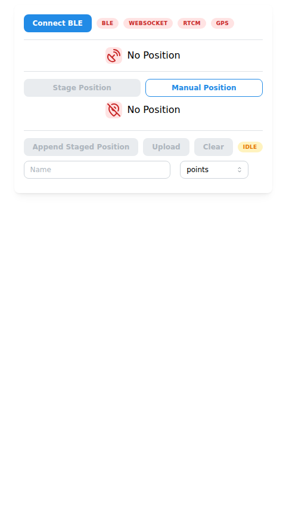
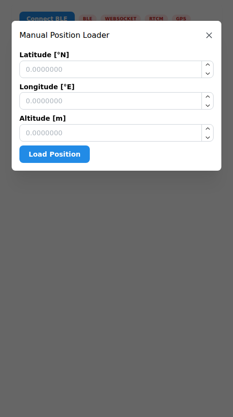
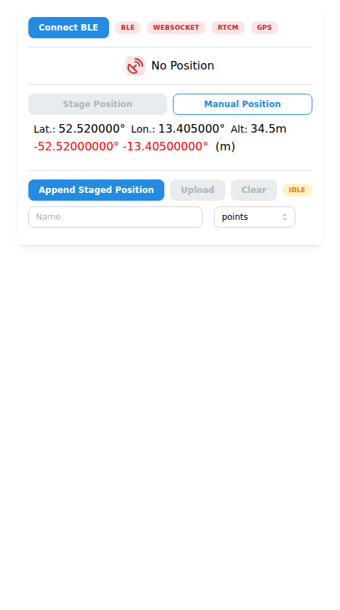
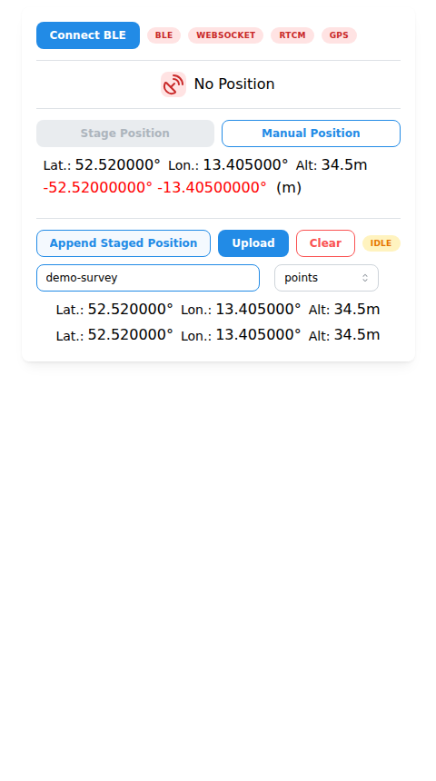

# Web UI Guide

The app is a single card, designed for a phone held next to the survey point.
It connects the GNSS receiver ("GPS RTK Stick") over BLE to the NTRIP
correction stream from the server.

## Status pills (top row)

Four small badges showing the health of each link in the chain. All four
must be green for RTK corrections to flow: phone ⇄ stick ⇄ server ⇄ caster.

| Pill | Red | Yellow | Green |
|------|-----|--------|-------|
| **BLE** | Not connected to the stick | Connected, but no NMEA message received in the last 5 s | Connected and receiving data |
| **WebSocket** | Not connected to the server | Connected, waiting for first RTCM data | Connected, RTCM data has arrived |
| **RTCM** | Position not yet sent to the caster | Position sent, no correction data back yet | Correction frames are arriving |
| **GPS** | No valid fix (`fixQuality` 0, or no GGA) | `fixQuality` 1 (GPS fix) or 5 (RTK float) | `fixQuality` 4 (RTK fixed) |

Quirks to know:

- **GPS pill**: `fixQuality` 2 (DGPS) and 6 (dead reckoning) currently also
  show **red** — only 1/5 map to yellow and 4 to green
  (`src/frontend/lib/status/GPSStatus.tsx`).
- The little **blue dot** on a pill is not a status: it flashes briefly
  whenever the underlying value updates (`FallbackIndicator`). Think of it
  as an "alive" blink.
- **WebSocket → Yellow → Green** only happens after RTCM arrives; on first
  connect it stays yellow until the caster pushes data.

## Current position

Second row. Red satellite-dish icon + "No Position" when nothing has been
received, yellow icon + "Invalid Position" when `fixQuality` is 0. With a
fix it shows lat/lon/alt plus the fix quality name in parentheses
(e.g. `(RTK Fixed)`).

## Position staging

- **Stage Position** — snapshots the *current* GNSS position as the
  reference/staged position. Disabled without a valid fix. Button color
  mirrors fix quality: **green** = RTK fixed, **yellow** = other valid fix,
  **red** = invalid.
- **Manual Position** — opens a dialog to stage coordinates by hand
  (useful for testing without the stick):

- **Staged position row** — shows the stored coordinates, then a live
  per-axis delta to the *current* position plus the haversine distance in
  meters. Delta colors: **red** = negative, **green** = positive,
  **black** = within dead-zone (~1e-6° ≈ 11 cm). This is the "did I get
  back to the same spot" indicator.

## GIS upload

Collects positions and stores them in PostGIS.

- **Append Staged Position** — pushes the staged position into the list
  (enabled only when a position is staged; highlighted while the list is
  empty).
- **Upload** — POSTs `{name, type, positions}` to `/upload`
  (enabled once the list is non-empty).
- **Clear** — empties the list (also persisted in browser local storage).
- **Name** — free text stored on every inserted row.
- **Type selector** — `points` (one row per position), `line`
  (one LINESTRING, needs ≥ 2 positions), `polygon` (one closed POLYGON,
  needs ≥ 3 positions).
- **Status pill** (right end) — react-query mutation state:
  `idle` (yellow) → `pending` → `success` (green) / `error` (red).

## Other details

- **Connect BLE** also requests a screen **wake lock** so the phone
  display doesn't sleep mid-survey.
- The position is sent to the server automatically once (when the first
  GGA arrives and the websocket is up) — that message starts the NTRIP
  client; later positions update it via `setXYZ`.
- Upload geometry is stored in **SRID 4258 (ETRS89)** as 2-D points;
  altitude is collected but not stored.
- Positions staged for upload survive a page reload (local storage), the
  *staged* position does not.
